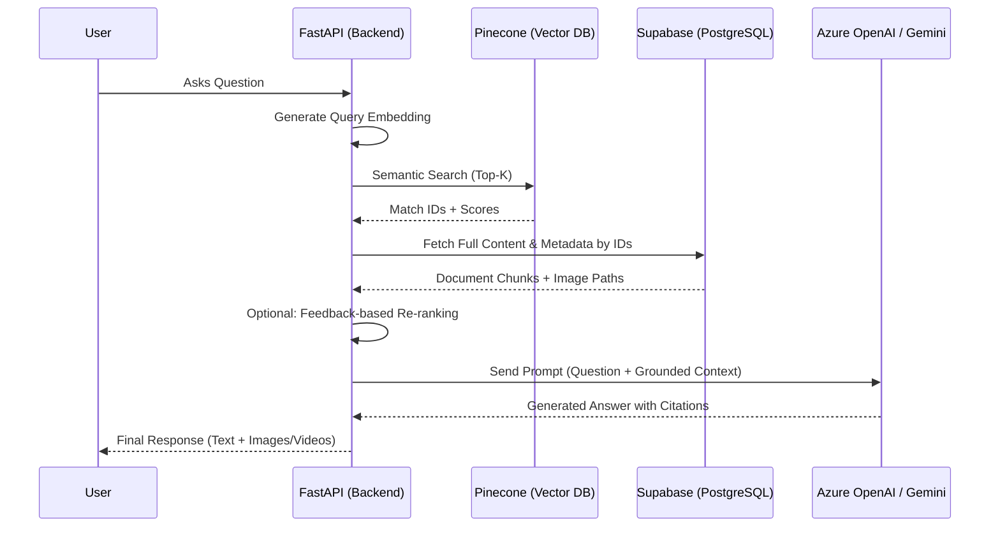

# CFC Chat-Talk - AI-Powered Documentation Chatbot

A Retrieval-Augmented Generation (RAG) chatbot system for CFC Technologies' animal feed software documentation. This FastAPI-based backend enables intelligent document search, Q&A capabilities, and video transcript processing through semantic search powered by Pinecone vector database.

## 📋 Table of Contents

- [Project Overview](#project-overview)
- [Key Components & Focus Areas](#key-components--focus-areas)
- [Important Files to Review](#important-files-to-review)
- [Credentials & Environment Setup](#credentials--environment-setup)
- [Quick Start Guide](#quick-start-guide)
- [Architecture Overview](#architecture-overview)
- [API Endpoints](#api-endpoints)
- [Next Steps & Improvements](#next-steps--improvements)
- [Support & Contact](#support--contact)
- [Project Status](#project-status)
---

<a id="quick-start-guide"></a>
## 🚀 Quick Start Guide

For a comprehensive guide on local development, CI/CD, and deployment overview, please see [**DEVELOPMENT_SETUP.md**](./DEVELOPMENT_SETUP.md).

### Prerequisites

- Python 3.10+
- Pinecone API Key (Required)
- OpenAI or Gemini API Key (Required for AI answers)

### 3-Step Local Setup

1. **Install Dependencies**:
   ```bash
   python -m venv .venv
   source .venv/bin/activate  # macOS/Linux
   # .venv\Scripts\activate   # Windows
   pip install -r requirements.txt
   ```

2. **Configure Environment**:
   ```bash
   cp .env.example .env
   # Edit .env and add your PINECONE_API_KEY and OPENAI_API_KEY/GEMINI_API_KEY
   ```

3. **Run the App**:
   ```bash
   uvicorn main:app --reload
   ```
   Access the UI at [http://localhost:8000](http://localhost:8000).

---

<a id="project-overview"></a>
## 🎯 Project Overview

**CFC Chat-Talk** is a production-ready MVP that transforms company documentation (DOC/DOCX/TXT) and video transcripts into a searchable knowledge base. Users can ask natural language questions and receive AI-powered answers with source citations.

### Current Capabilities

✅ **Document Processing**: Upload and ingest DOC/DOCX/TXT files with automatic chunking and image extraction  
✅ **Semantic Search**: Vector-based search using Pinecone for finding relevant content  
✅ **AI Q&A**: Generate answers using OpenAI/Gemini with context from retrieved documents  
✅ **Video Processing**: Upload videos with Whisper transcription and searchable transcripts  
✅ **Web UI**: React-based frontend for document uploads and chat interactions  
✅ **Content Storage**: Local file storage with optional Supabase cloud integration  

### Technology Stack

- **Backend**: FastAPI (Python)
- **Vector Database**: Pinecone
- **Embeddings**: sentence-transformers (`all-MiniLM-L6-v2`)
- **LLM**: OpenAI GPT / Google Gemini (for answer generation)
- **Frontend**: React 18 (served as static files)
- **Storage**: Local filesystem + optional Supabase
- **Video Transcription**: OpenAI Whisper


### API Endpoints

Please refer to https://mnscu-my.sharepoint.com/:w:/r/personal/lm1263ei_go_minnstate_edu/Documents/CFC/Design%20Docs/Test%20Plan.docx?d=w660fa584e60b4c429a24b61283d471cc&csf=1&web=1&e=8Nj2SB for more details.  

### Core Services

| File | Purpose | Key Functionality |
|------|---------|-------------------|
| `app/services/chat_service.py` | Main chat business logic | `search_documents()`, `ask_question()` |
| `app/services/document_processor.py` | Document parsing and chunking | `process_document()` |
| `app/core/rag.py` | RAG pipeline implementation | `retrieve_context()`, `format_context()` |
| `app/core/vector_store.py` | Pinecone integration | `query()`, `upsert_vectors()` |
| `app/core/embeddings.py` | Embedding model wrapper | `encode_query()`, `encode_documents()` |

### Content Storage

| File | Purpose | Notes |
|------|---------|-------|
| `app/services/content_repository.py` | Local file storage | Default implementation |
| `app/services/supabase_content_repository.py` | Supabase cloud storage | Optional, enabled via config |

### Frontend

| File | Purpose | Key Components |
|------|---------|----------------|
| `web/app.jsx` | Main React application | Login, Chat, Admin, Upload flows |
| `web/styles.css` | Styling | All UI styles |
| `web/index.html` | HTML entry point | React app container |

### Configuration & Models

| File | Purpose |
|------|---------|
| `app/api/models/requests.py` | Request models (SearchRequest, AskRequest, etc.) |
| `app/api/models/responses.py` | Response models (SearchResponse, AskResponse, etc.) |

### Documentation

| File | Purpose |
|------|---------|
| `HANDOVER_DOCUMENT.md` | Comprehensive technical handover document |
| `SETUP_GUIDE.md` | Quick setup instructions |

---

<a id="credentials--environment-setup"></a>
## 🔑 Credentials & Environment Setup

### Required Environment Variables

Create a `.env` file in the project root with the following variables:

#### **Required Credentials** (Get from Dan Bates)

```bash
# Pinecone (REQUIRED for vector search)
# Contact Dan Bates from CFC Tech to obtain these credentials
PINECONE_API_KEY=your_pinecone_api_key_here
PINECONE_INDEX_NAME=cfc-animal-feed-chatbot
PINECONE_CLOUD=aws
PINECONE_REGION=us-east-1

# Optional: Separate index for videos
PINECONE_VIDEO_INDEX_NAME=cfc-animal-feed-chatbot-videos
PINECONE_NAMESPACE=your_namespace  # Optional
```

#### **Optional Credentials**

```bash
# Supabase (for cloud storage - optional)
# Contact Dan Bates from CFC Tech to obtain these credentials
SUPABASE_URL=https://your-project.supabase.co
SUPABASE_ANON_KEY=your_supabase_anon_key
SUPABASE_BUCKET=your_bucket_name
SUPABASE_BUCKET_VIDEOS=your_videos_bucket_name

# OpenAI (for AI-generated answers)
# You can create your own account or ask Dan Bates
OPENAI_API_KEY=your_openai_api_key_here

# Google Gemini (alternative to OpenAI)
# You can create your own account
GEMINI_API_KEY=your_gemini_api_key_here
GEMINI_MODEL=gemini-2.0-flash
```

### How to Get Credentials

1. **Pinecone API Key** (REQUIRED): 
   - **Contact Dan Bates from CFC Tech** to get access to the Pinecone API key and index details
   - The existing Pinecone index is already configured with dimension `384` (matches `all-MiniLM-L6-v2` embedding model)
   - You'll receive: `PINECONE_API_KEY`, `PINECONE_INDEX_NAME`, and other Pinecone configuration values

2. **Supabase Credentials** (Optional):
   - **Contact Dan Bates from CFC Tech** to get access to Supabase credentials
   - You'll receive: `SUPABASE_URL`, `SUPABASE_ANON_KEY`, and bucket names
   - These are optional - the system works with local file storage if Supabase is not configured

3. **Gemini API Key** (Optional - Alternative to OpenAI):
   - Get from [Google AI Studio](https://makersuite.google.com/app/apikey)
   - Can be used instead of OpenAI for answer generation

### Environment File Setup

```bash
# Windows (PowerShell)
Copy-Item -LiteralPath '.env.example' -Destination '.env'

# Windows (CMD)
copy .env.example .env

# macOS/Linux
cp .env.example .env
```

Then edit `.env` and add your credentials.

<a id="architecture-overview"></a>
## 🏗️ Architecture Overview

### System Flow: The RAG Loop



<a id="important-files-to-review"></a>
## 📁 Important Files to Review

### Core Application Files

| File | Purpose | Key Logic |
|------|---------|-----------|
| `main.py` | Application entry point and router registration | App lifecycle & CORS |
| `app/config.py` | Centralized configuration (API keys, paths, settings) | Env var management |
| `app/core/rag.py` | Core RAG logic: retrieval and context formatting | **Metadata fetch from Supabase** |
| `app/services/chat_service.py` | Main orchestration for chat and search | Image ranking & LLM prompts |

### Component Architecture

```
┌─────────────────────────────────────────────────────────────┐
│                      Frontend (React)                        │
│  web/app.jsx - Login, Chat, Admin, Upload interfaces        │
└───────────────────────┬─────────────────────────────────────┘
                        │ HTTP/REST
┌───────────────────────▼─────────────────────────────────────┐
│                   FastAPI Backend                           │
│  ┌──────────────┐  ┌──────────────┐  ┌──────────────┐     │
│  │ API Endpoints│  │   Services   │  │    Core      │     │
│  │ - chat.py    │→ │ - chat_svc   │→ │ - rag.py     │     │
│  │ - upload.py  │  │ - doc_proc   │  │ - embeddings│     │
│  │ - ingest.py  │  │ - content_repo│ │ - vector_db  │     │
│  └──────────────┘  └──────────────┘  └──────────────┘     │
└───────────────────────┬───────────────────────┬─────────────┘
                        │                       │
        ┌───────────────▼──────────────┐  ┌─────▼──────────────┐
        │       Vector Search          │  │  Relational/Auth   │
        │  Pinecone (Vector DB)        │  │  Supabase (Postgres)│
        └──────────────────────────────┘  └────────────────────┘
```

### Data Flow: Document Ingestion

```
Document Upload → DocumentProcessor → Text Cleaning → Chunking
                                                         ↓
                                              Generate Embeddings
                                                         ↓
    ┌────────────────────────────────────────────────────┴────────────────────────────────────┐
    │                                                    │                                    │
    ▼                                                    ▼                                    ▼
Pinecone Index                              Supabase (PostgreSQL)                    Local FS / Storage
(Vectors + IDs)                             (Content + Full Metadata)                (Originals + Images)
```

### Data Flow: Query Processing

1. **User Query**: Received via `POST /api/chat/ask`.
2. **Retrieval**: 
   - Query is embedded using `all-MiniLM-L6-v2`.
   - **Pinecone** returns IDs of the top 5-10 most similar chunks.
   - **Supabase** is queried to fetch the actual text content and image paths for those specific IDs.
3. **Synthesis**:
   - `RAGPipeline` formats the context with `[CHUNK_ID]` markers for citation.
   - **Azure OpenAI** (primary) or Gemini generates a grounded response.
4. **Response**: Answer is returned with clickable citations and relevant document images.

---

<a id="api-endpoints"></a>
## 📡 API Endpoints

### Document Management

| Endpoint | Method | Description |
|----------|--------|-------------|
| `/api/files/upload` | POST | Upload single file with auto-ingestion |
| `/api/ingest/document` | POST | Process document by filename |
| `/api/ingest/bulk` | POST | Bulk process directory contents |

### Search & Chat

| Endpoint | Method | Description |
|----------|--------|-------------|
| `/api/chat/search` | POST | Semantic document search (returns chunks) |
| `/api/chat/ask` | POST | Q&A with AI-generated answers |
| `/api/chat/ask/video` | POST | Video transcript-specific Q&A |
| `/api/chat/recommendations` | POST | Content recommendations based on query |
| `/api/chat/sessions` | GET/POST | Chat session management |

### Auth & Profile

| Endpoint | Method | Description |
|----------|--------|-------------|
| `/api/auth/config` | GET | Supabase config for client |
| `/api/auth/forgot-password` | POST | Password reset |
| `/api/profile/me` | GET/PATCH | User profile |

### Admin

| Endpoint | Method | Description |
|----------|--------|-------------|
| `/api/admin/users` | GET | List all users |
| `/api/admin/invite` | POST | Generate invitation code |
| `/api/admin/settings` | GET/PATCH | Admin settings |
| `/api/admin/ingestion/stats` | GET | Ingestion statistics |

### System

| Endpoint | Method | Description |
|----------|--------|-------------|
| `/api/health` | GET | Health check |
| `/api/visibility/vector-store` | GET | Pinecone index statistics |

### Video Processing

| Endpoint | Method | Description |
|----------|--------|-------------|
| `/api/videos/upload` | POST | Video upload with Whisper transcription |

### Interactive API Documentation

Visit [http://localhost:8000/docs](http://localhost:8000/docs) for interactive Swagger UI documentation with request/response schemas.

---

<a id="next-steps--improvements"></a>
## 🎯 Next Steps & Improvements

### Immediate Priorities

1. **Implement Authentication** 🔐
   - JWT-based auth system
   - Role-based access control
   - Secure API endpoints

2. **Add Chat History** 💬
   - Database schema for sessions/messages
   - Backend persistence
   - Frontend integration

3. **Enhance Security** 🛡️
   - Fix CORS configuration
   - Add rate limiting
   - Input validation and sanitization

### Medium-Term Enhancements

4. **Feedback System** ⭐
   - Rating collection
   - Analytics dashboard
   - ML training data export

5. **RAG Quality** 🧠
   - Hybrid search (vector + keyword)
   - Re-ranking models
   - Better chunking strategies

6. **Testing & Monitoring** 📊
   - Comprehensive test suite
   - Structured logging
   - Performance metrics

### Long-Term Goals

7. **CFC Integration** 🔗
   - Analytics platform integration
   - Usage metrics dashboard
   - Batch data exports

8. **Performance** ⚡
   - Redis caching
   - Async processing
   - Connection pooling

9. **Documentation** 📚
   - Architecture diagrams
   - API reference
   - Developer guides

---

<a id="support--contact"></a>
## 🆘 Support & Contact

### Questions or Issues?

**Contact**: **Dan Bates from CFC Tech**

**Important**: Dan Bates is your primary contact for:
- **Pinecone API credentials** (required)
- **Supabase credentials** (optional)
- Project architecture and design decisions
- Integration requirements
- Business logic and requirements
- Technical clarifications

For other credentials (OpenAI, Gemini), you can create your own accounts or ask Dan Bates if CFC has shared accounts.

### Additional Resources

- **Technical Handover**: See `HANDOVER_DOCUMENT.md` for comprehensive technical details
- **Setup Guide**: See `SETUP_GUIDE.md` for quick setup instructions
- **API Docs**: Visit `/docs` endpoint when server is running
- **Code Comments**: Most files have inline documentation

### Common Issues

**Pinecone Connection Errors**:
- **Contact Dan Bates** if you don't have the Pinecone API key
- Verify `PINECONE_API_KEY` is set correctly in `.env`
- Check index name matches the one provided by Dan Bates
- Ensure index dimension is `384`

**Document Processing Fails**:
- Ensure Office/LibreOffice is installed for `.doc` files
- Check file permissions in `data/documents/` directory
- Review logs for specific error messages

**No Search Results**:
- Verify documents have been ingested (`/api/visibility/vector-store`)
- Check Pinecone index has vectors
- Try different query keywords

**Frontend Not Loading**:
- Ensure server is running: `http://localhost:8000`
- Check browser console for errors
- Verify `CORS_ORIGINS` in `.env` includes your domain in production

---

<a id="project-status"></a>
## 📝 Project Status

**Current Version**: 1.0.0  
**Status**: Functional MVP - Ready for production enhancements  
**Last Updated**: See git commit history

### What's Working ✅

- Document ingestion and processing
- Vector search with Pinecone
- AI-powered Q&A
- Video transcription
- Web UI for uploads and chat
- Local and cloud storage options

### What Needs Work 🚧

- Authentication and authorization
- Chat history persistence
- Feedback collection system
- Enhanced RAG quality
- Comprehensive testing
- Production monitoring


---

**Built for CFC Technologies** 🚀
